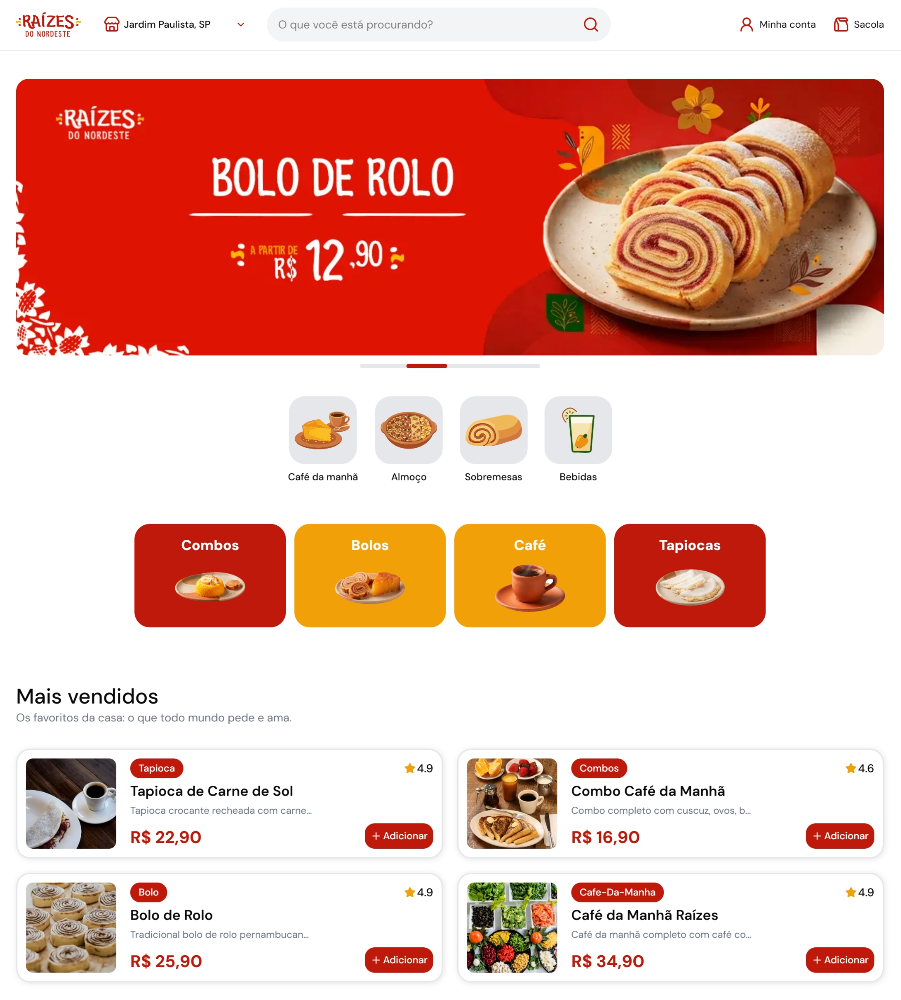
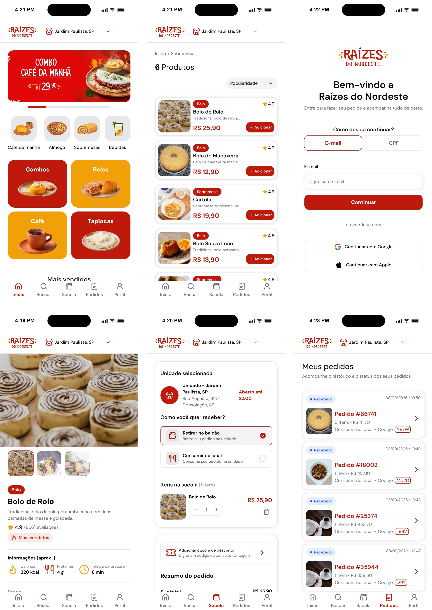

# Raízes do Nordeste 🥗🍴

<h3 align="center">Status: 🛠️ In development</h3>

<p align="center">
  
  
  
  
</p>

## Table of Contents
  - [Description](#description)
  - [Screenshots](#screenshots)
  - [Tech stack](#tech-stack)
  - [Features](#features)
  - [Project structure](#project-structure)
  - [Available routes](#available-routes)
  - [Mock coupons](#mock-coupons-and-loyalty-rewards)
  - [Mock checkout](#mock-checkout)
  - [Getting started](#getting-started)
  - [Mock data](#mock-data)
  - [Documentation](#documentation)


## Description

Academic front-end web project that simulates a restaurant ordering platform inspired by Northeastern Brazilian cuisine. Customers can browse a unit-specific menu, search products, manage a bag, apply coupons, complete a mock checkout, track orders, join a loyalty program, and manage account and privacy preferences.

The app is a **Next.js customer experience**. Catalog, users, orders, coupons, and payment are **mocked** in this version. There is no external payment gateway and no administrative back office.

Live deployment: [raizes-do-nordeste-pi.vercel.app](https://raizes-do-nordeste-pi.vercel.app)

## Screenshots

<p align="center">
  
</p>

<p align="center">
  
</p>

## Design

[Figma — Raízes do Nordeste](https://www.figma.com/design/lisGkmwbyV2SNsdruPS3Kp/Ra%C3%ADzes-do-Nordeste?node-id=0-1)

## Tech stack

- [Next.js](https://nextjs.org/) 
- [React](https://react.dev/)
- [TypeScript](https://www.typescriptlang.org/)
- [Tailwind CSS](https://tailwindcss.com/) 
- [shadcn/ui](https://ui.shadcn.com/) (Base Luma style; primitives under `src/components/ui`)
- [Lucide React](https://lucide.dev/) and [Phosphor Icons](https://phosphoricons.com/)
- [Zustand](https://github.com/pmndrs/zustand)
- [Zod](https://zod.dev/)
- [react-markdown](https://github.com/remarkjs/react-markdown) for legal pages

## Features

### Implemented

- Sign-up and sign-in (email or CPF), stored in the browser
- Restaurant unit selection (menus differ by unit)
- Home with banners, category shortcuts, best sellers, and daily dishes
- Menu browsing by category slug (`/cardapio/[slug]`)
- Product details and related products
- Product search
- Shopping bag (quantities, pickup or dine-in, coupons)
- Mock checkout with success and error outcomes
- Order confirmation, status, pickup code, and order history
- Loyalty enrollment, points, reward redemption, and coupon use
- Account profile and consent settings (cookies, loyalty, privacy)
- Terms of Use and Privacy Policy (academic/fictional legal copy)
- Cookie consent banner
- Responsive layout (header on desktop, bottom navigation on mobile)

### Out of scope in this version

These items appear as placeholders, TODOs, or mock seams in the code. They are **not** implemented as real integrations:

- External payment gateway (`src/lib/mock-checkout/mock-payment-gateway.ts` and `src/actions/finish-bag.ts`)
- Remote API or database for catalog, users, and orders
- Profile links that currently point to `#` (preferences, delete account, help center, contact)


## Project structure

Pages live under `src/app`. UI for a given screen lives next to a matching folder in `src/components` (for example, `(site)/page.tsx` is the home page and uses `src/components/home`).

```text
src/
├── app/                 # Routes and layouts (App Router)
├── components/          # Feature UI, grouped by screen or domain
├── actions/             # Server actions (cookies, coupons, auth helpers)
├── data/                # Mock catalogs, units, coupons, legal markdown
├── lib/                 # Domain helpers, auth mock, mock checkout
├── store/               # Zustand stores (auth, bag, unit)
├── hooks/
├── types/
├── schema/              # Zod schemas (auth)
├── providers/           # Client hydration of stores from cookies
├── utils/
└── proxy.ts             # Auth gate for selected routes
```

| Path                                      | Role                                     |
| ----------------------------------------- | ---------------------------------------- |
| `src/app/(site)/page.tsx`                 | Home                                     |
| `src/app/(site)/cardapio/[slug]/page.tsx` | Menu by category                         |
| `src/app/(site)/produto/[slug]/page.tsx`  | Product                                  |
| `src/app/(site)/buscar/`                  | Search                                   |
| `src/app/(site)/sacola/`                  | Bag and coupon intercepting route        |
| `src/app/(site)/checkout/`                | Checkout success / error                 |
| `src/app/(auth)/entrar/page.tsx`          | Sign-in / sign-up                        |
| `src/app/(site)/(protected)/`             | Profile, orders, consents (with sidebar) |
| `src/components/home/`                    | Home sections                            |
| `src/components/ui/`                      | Shared shadcn primitives                 |
| `src/data/`                               | Mock data and legal markdown             |
| `src/lib/mock-checkout/`                  | Simulated payment and order creation     |
| `src/lib/auth-mock.ts`                    | Users in `localStorage`                  |

## Available routes

| Route                              | Description                                                                |
| ---------------------------------- | -------------------------------------------------------------------------- |
| `/`                                | Home                                                                       |
| `/cardapio/[slug]`                 | Menu filtered by category or tag (for example `/cardapio/cafe-da-manha`)   |
| `/produto/[slug]`                  | Product details                                                            |
| `/buscar`                          | Search prompt (mobile search field)                                        |
| `/buscar/[query]`                  | Search results                                                             |
| `/sacola`                          | Shopping bag                                                               |
| `/sacola/cupom`                    | Coupon UI (modal intercept on bag; full navigation redirects to `/sacola`) |
| `/entrar`                          | Authentication                                                             |
| `/checkout/sucesso`                | Payment success (`?orderId=`)                                              |
| `/checkout/erro`                   | Payment failure (`?orderId=`)                                              |
| `/pedidos`                         | Order history (requires auth cookie)                                       |
| `/perfil`                          | Profile (requires auth cookie)                                             |
| `/perfil/gerenciar-consentimentos` | Consent settings (requires auth cookie)                                    |
| `/programa-de-fidelidade`          | Loyalty (requires auth cookie)                                             |
| `/termos-de-uso`                   | Terms of Use                                                               |
| `/politica-de-privacidade`         | Privacy Policy                                                             |

Home category shortcuts currently link to: `cafe-da-manha`, `almoco`, `sobremesa`, `bebida`, `combo`, `bolo`, `cafe`, `tapioca`.

## Mock coupons and loyalty rewards

Promotional coupons: `src/data/coupon.ts`. Loyalty rewards: `src/data/loyalty_rewards.ts`.

### Promotional coupons

| Code             | Discount | Minimum order | Notes                                         |
| ---------------- | -------: | ------------: | --------------------------------------------- |
| `PRIMEIRACOMPRA` |  R$ 5.00 |             — |                                               |
| `CAFE5`          |  R$ 5.00 |      R$ 25.00 |                                               |
| `EXPIRADO`       | R$ 10.00 |             — | Expired (`2023-01-01`); use to test rejection |
| `DOMINGO10`      | R$ 10.00 |      R$ 50.00 |                                               |
| `TAPIOCA5`       |  R$ 5.00 |      R$ 20.00 | Expires `2027-04-30`                          |
| `FAMILIA20`      | R$ 20.00 |     R$ 100.00 |                                               |

### Loyalty rewards

Rewards must be claimed in the loyalty program before use. Points are capped at **1000**. Successful mock payments credit `floor(order total)` points.

| Code           |  Discount | Minimum order | Points |
| -------------- | --------: | ------------: | -----: |
| `RAIZES5`      |   R$ 5.00 |      R$ 15.00 |     60 |
| `NORDESTE15`   |  R$ 15.00 |      R$ 45.00 |    180 |
| `RAIZES15`     |  R$ 15.00 |      R$ 75.00 |    200 |
| `RAIZES30`     |  R$ 30.00 |      R$ 80.00 |    350 |
| `NORDESTINO40` |  R$ 40.00 |     R$ 100.00 |    450 |
| `RAIZES55`     |  R$ 55.00 |     R$ 130.00 |    600 |
| `RAIZES75`     |  R$ 75.00 |     R$ 170.00 |    700 |
| `VIP100`       | R$ 100.00 |     R$ 220.00 |    850 |
| `VIP180`       | R$ 180.00 |     R$ 220.00 |   1000 |
| `CASA150`      | R$ 150.00 |     R$ 300.00 |   1000 |

## Mock checkout

Payment is simulated in `src/lib/mock-checkout/mock-payment-gateway.ts`:

```ts
const HARDCODED_RESULT = true; // true = success | false = error
```

- `true` → order status `confirmed`, pickup code generated, redirect to `/checkout/sucesso`
- `false` → order status `awaiting_payment`, redirect to `/checkout/erro`

There is no real gateway in this version.

## Getting started

Requirements: Node.js and npm (or a compatible package manager).

```bash
npm install
npm run dev
```

Open [http://localhost:3000](http://localhost:3000).

Other scripts:

```bash
npm run build
npm run start
npm run lint
```

Create an account at `/entrar`. Users and orders persist in the browser (`localStorage`). Auth, bag, and selected unit also use cookies (`auth_token`, `bag`, `selected-unit`).

## Mock data

| File                              | Contents                                                                 |
| --------------------------------- | ------------------------------------------------------------------------ |
| `src/data/product.ts`             | Product catalog                                                          |
| `src/data/menus.ts`               | Per-unit menus (availability, optional price override, extra categories) |
| `src/data/units.ts`               | Restaurant units                                                         |
| `src/data/banners.ts`             | Home banners                                                             |
| `src/data/coupon.ts`              | Promotional coupons                                                      |
| `src/data/loyalty_rewards.ts`     | Loyalty rewards                                                          |
| `src/data/terms-use.md`           | Terms of Use                                                             |
| `src/data/policy-and-politics.md` | Privacy Policy                                                           |

Users: `src/lib/auth-mock.ts` (`mock_users`). Orders: `src/lib/mock-checkout/order-mock.ts` (`mock_orders`).

## Documentation

For architecture, route-to-component maps, cookies, and checkout flow, see **[docs/project-guide.md](docs/project-guide.md)**.

---

<h3 align="center">This project was made by Pedro Silva</h3>